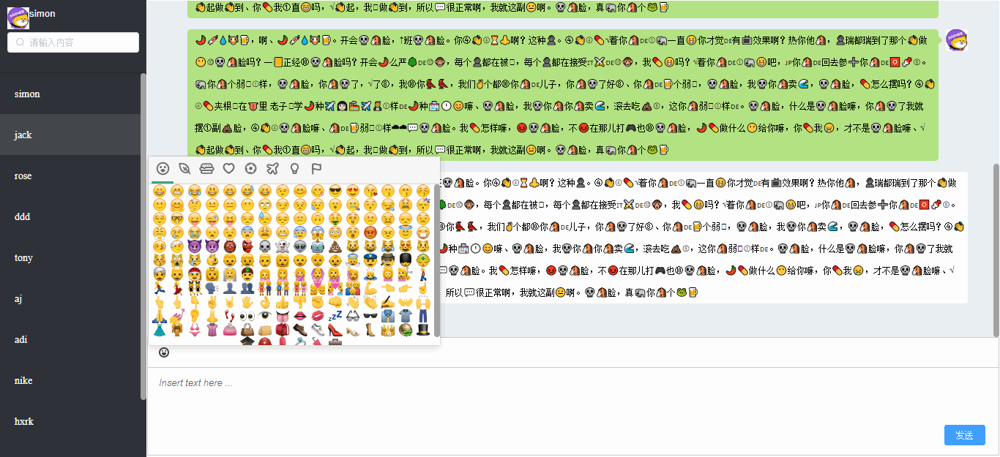

<p align="center">
<a href="http://www.oracle.com/technetwork/java/javase/overview/index.html"></a>
<a href="https://github.com/vuejs/vue">
    
  </a>
  <a href="https://github.com/ElemeFE/element">
    
  </a>
<a href="https://www.jetbrains.com/idea/"></a>
<a href="http://projects.spring.io/spring-boot/"></a>


</p>

# michat

## 简介
一个基于小米即时消息云服务(MIMC)的Web IM。  
源码地址[github](https://github.com/jeesun/michat)和[gitee](https://gitee.com/jeesun/michat)同步。

## 截图展示


## 特性
1. 登录时自动获取离线消息；
2. 支持emoji表情；
3. 其他MIMC特性。

## 如何使用
1. 请先双击目录“需要安装的jars”的install.bat，安装自定义的jars。
2. 直接运行类MichatApplication，启动项目。访问[http://localhost:8081/login](http://localhost:8081/login)，登录账号。
如果要模拟两个用户互相发送消息，请使用两个浏览器分别登陆不同的用户。
默认配置了以下账号做测试：
```
用户名 密码
user 123456
admin 123456
jack 123456
rose 123456
simon 123456
ddd 123456
```

## 如何配置自己的MIMC
登录[https://dev.mi.com/console/appservice/mimc.html](https://dev.mi.com/console/appservice/mimc.html)，注册并创建应用，修改
chatIndex.js的mimc_appId，mimc_appSecret，mimc_appKey为你自己的值。

## 为什么是Spring Boot架构
偷懒解决登录问题。跟Spring Boot没关系，基本是前端代码。